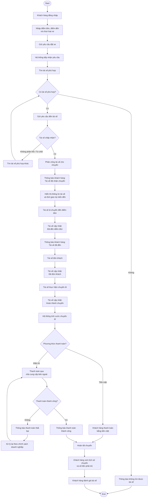

## 1. Stakeholders

| Stakeholder | Vai trò / Mối quan tâm đối với hệ thống |
|---|---|
| **Khách hàng (Customer)** | Sử dụng dịch vụ đặt xe: đăng ký/đăng nhập, đặt xe, theo dõi chuyến đi, thanh toán, xem lịch sử và đánh giá tài xế. |
| **Tài xế (Driver)** | Nhận hoặc từ chối chuyến, cập nhật trạng thái hoạt động và trạng thái chuyến đi, cung cấp thông tin vị trí và quản lý hồ sơ/phương tiện. |
| **Nhân viên vận hành (Operation Staff)** | Quản lý khách hàng, tài xế, phương tiện và chuyến đi; theo dõi chuyến đang diễn ra, hỗ trợ xử lý lỗi và tra cứu lịch sử giao dịch. |
| **Ban lãnh đạo / Ban giám đốc (Management)** | Đưa ra yêu cầu và định hướng phát triển hệ thống; theo dõi báo cáo về số lượng chuyến, doanh thu, tỷ lệ hoàn thành, tỷ lệ hủy và hiệu quả hoạt động của tài xế. |
| **Nhà cung cấp thanh toán (Payment Provider)** | Hệ thống bên ngoài được tích hợp với CAB System để xử lý các giao dịch thanh toán điện tử. |
| **Nhà cung cấp dịch vụ thông báo (Notification Provider)** | Hỗ trợ gửi thông báo cho khách hàng và tài xế; có thể mở rộng thêm các kênh hoặc nhà cung cấp thông báo trong tương lai. |
| **Business Analyst (BA)** | Xác định phạm vi, tác nhân, quy trình nghiệp vụ, yêu cầu chức năng/phi chức năng, quy tắc nghiệp vụ, trường hợp ngoại lệ và làm rõ các yêu cầu chưa xác định. |
| **Nhóm phát triển (Development Team)** | Xây dựng và triển khai CAB System dựa trên các yêu cầu đã được BA làm rõ với các bên liên quan. |

## 2. Stakeholder Matrix

Ma trận dưới đây đánh giá mức độ quan tâm (Interest) và mức độ ảnh hưởng (Power) của từng stakeholder đối với dự án, làm cơ sở xác định cách thức trao đổi và mức độ ưu tiên khi thu thập/xác nhận yêu cầu.

### Stakeholder Matrix - CAB System

| | **Low Interest** | **High Interest** |
|---|---|---|
| **High Power** | **Keep Satisfied** <br><br> • Nhà cung cấp thanh toán | **Manage Closely** <br><br> • Ban lãnh đạo <br> • Nhân viên vận hành |
| **Low Power** | **Monitor** <br><br> • Nhà cung cấp thông báo | **Keep Informed** <br><br> • Khách hàng <br> • Tài xế |

### Cách tiếp cận Stakeholder

| Stakeholder | Quadrant | Cách tiếp cận |
|---|---|---|
| **Ban lãnh đạo** | Manage Closely | Trao đổi thường xuyên, xác nhận mục tiêu kinh doanh và các chỉ số báo cáo. |
| **Nhân viên vận hành** | Manage Closely | Thu thập chi tiết nghiệp vụ vận hành hằng ngày, xác nhận quy trình xử lý ngoại lệ. |
| **Khách hàng** | Keep Informed | Thu thập kỳ vọng trải nghiệm sử dụng, thông báo tiến độ khi cần. |
| **Tài xế** | Keep Informed | Thu thập kỳ vọng về quy trình nhận chuyến và cập nhật trạng thái. |
| **Nhà cung cấp thanh toán** | Keep Satisfied | Xác nhận chuẩn tích hợp và yêu cầu bảo mật giao dịch. |
| **Nhà cung cấp thông báo** | Monitor | Xác nhận các kênh thông báo hỗ trợ và khả năng mở rộng. |

## 3. Business Goals

Các Business Goals của dự án CAB System được xác định dựa trên những vấn đề của hệ thống hiện tại và kỳ vọng phát triển lâu dài của doanh nghiệp.

| ID | Business Goal | Mô tả |
|---|---|---|
| **BG-01** | Tự động hóa quy trình đặt và phân công xe | Giảm việc phân công tài xế thủ công bằng cách tự động tìm và ưu tiên tài xế phù hợp dựa trên vị trí, trạng thái sẵn sàng và các tiêu chí vận hành. |
| **BG-02** | Nâng cao trải nghiệm khách hàng | Cho phép khách hàng đặt xe, theo dõi trạng thái chuyến đi, biết tài xế đã nhận chuyến, thời gian dự kiến tài xế đến, xem lịch sử chuyến và đánh giá tài xế. |
| **BG-03** | Quản lý tập trung quy trình chuyến đi và thanh toán | Quản lý xuyên suốt quá trình từ tạo yêu cầu đặt xe, thực hiện chuyến, tính cước đến thanh toán và lưu trữ thông tin giao dịch. |
| **BG-04** | Nâng cao hiệu quả vận hành | Cung cấp công cụ cho nhân viên vận hành quản lý khách hàng, tài xế, phương tiện và chuyến đi; theo dõi hoạt động và hỗ trợ xử lý các trường hợp phát sinh. |
| **BG-05** | Hỗ trợ quản lý và ra quyết định | Cung cấp báo cáo về số lượng chuyến, doanh thu, tỷ lệ chuyến hoàn thành, tỷ lệ hủy và hiệu quả hoạt động của tài xế. |
| **BG-06** | Đảm bảo khả năng phục vụ khi nhu cầu tăng cao | Xây dựng hệ thống hoạt động ổn định khi tải tăng và cho phép các thành phần của hệ thống mở rộng độc lập. |
| **BG-07** | Xây dựng nền tảng có khả năng phát triển lâu dài | Cho phép bổ sung loại dịch vụ, phương thức thanh toán, nhà cung cấp thông báo và thay đổi một số thành phần kỹ thuật mà không phải xây dựng lại toàn bộ ứng dụng. |

## 4. MVP Modules

MVP tập trung vào các module cần thiết để CAB System có thể vận hành được quy trình đặt xe cốt lõi trong giai đoạn đầu.

| ID | Module | Chức năng chính |
|---|---|---|
| **M01** | Authentication & User Management | Đăng ký, đăng nhập, cập nhật thông tin cá nhân; xác thực người dùng và quản lý quyền truy cập. |
| **M02** | Customer Booking | Cho phép khách hàng nhập điểm đón, điểm đến, chọn loại xe và gửi yêu cầu đặt xe. |
| **M03** | Driver & Vehicle Management | Quản lý hồ sơ tài xế, thông tin phương tiện, vị trí và trạng thái sẵn sàng nhận chuyến. |
| **M04** | Driver Matching & Assignment | Tìm và ưu tiên tài xế phù hợp dựa trên vị trí, trạng thái sẵn sàng và tiêu chí vận hành; tiếp tục tìm tài xế khác nếu tài xế từ chối hoặc không phản hồi. |
| **M05** | Trip Management & Tracking | Quản lý vòng đời chuyến đi và các trạng thái như tài xế nhận chuyến, đến điểm đón, đón khách, đang di chuyển và hoàn thành chuyến. |
| **M06** | Fare & Payment | Tính số tiền phải trả sau chuyến đi; hỗ trợ thanh toán tiền mặt và thanh toán điện tử thông qua nhà cung cấp bên ngoài. |
| **M07** | Notification | Gửi thông báo về các sự kiện quan trọng như tiếp nhận yêu cầu, tài xế nhận chuyến, tài xế đến điểm đón, hoàn thành chuyến và kết quả thanh toán. |
| **M08** | Operations & Administration | Cho phép nhân viên vận hành quản lý khách hàng, tài xế, phương tiện và chuyến đi; theo dõi chuyến đang diễn ra và hỗ trợ xử lý các trường hợp lỗi. |

## 5. BUSINESS REQUIREMENTS

| ID | Business Requirement | Description | Priority |
|---|---|---|---|
| BR01 | Quản lý tài khoản khách hàng | Khách hàng có thể đăng ký, đăng nhập và quản lý thông tin cá nhân. | Must Have |
| BR02 | Đặt xe | Khách hàng nhập điểm đón, điểm trả và lựa chọn loại xe để đặt chuyến. | Must Have |
| BR03 | Phân công tài xế | Hệ thống tìm và phân công tài xế phù hợp dựa trên vị trí, trạng thái sẵn sàng và tiêu chí vận hành. | Must Have |
| BR04 | Quản lý chuyến xe | Tài xế có thể nhận, chấp nhận hoặc từ chối chuyến và cập nhật trạng thái chuyến xe. | Must Have |
| BR05 | Theo dõi chuyến xe | Khách hàng có thể theo dõi trạng thái chuyến, thông tin tài xế và thời gian dự kiến đến. | Must Have |
| BR06 | Thanh toán | Hệ thống hỗ trợ thanh toán bằng tiền mặt hoặc thanh toán điện tử thông qua nhà cung cấp bên ngoài. | Must Have |
| BR07 | Thông báo | Hệ thống gửi thông báo về đặt xe, phân công tài xế, tài xế đến, hoàn thành chuyến và kết quả thanh toán. | Must Have |
| BR08 | Đánh giá chuyến đi | Khách hàng có thể đánh giá chuyến xe sau khi hoàn thành. | Should Have |
| BR09 | Quản lý tài xế | Nhân viên vận hành có thể quản lý thông tin, phương tiện và trạng thái hoạt động của tài xế. | Must Have |
| BR10 | Quản lý khách hàng | Nhân viên vận hành có thể quản lý thông tin khách hàng. | Must Have |
| BR11 | Quản lý chuyến xe | Nhân viên vận hành có thể theo dõi các chuyến đang hoạt động và xử lý các vấn đề phát sinh. | Must Have |
| BR12 | Quản lý giao dịch | Hệ thống hỗ trợ lưu trữ và tra cứu lịch sử giao dịch. | Must Have |
| BR13 | Báo cáo hoạt động | Hệ thống cung cấp báo cáo về số lượng chuyến, doanh thu, tỷ lệ hoàn thành, tỷ lệ hủy và hiệu suất tài xế. | Should Have |
| BR14 | Bảo mật dữ liệu | Hệ thống phải bảo vệ dữ liệu cá nhân, thông tin phương tiện, vị trí và giao dịch của người dùng. | Must Have |
| BR15 | Phân quyền truy cập | Hệ thống kiểm soát quyền truy cập dựa trên vai trò của người dùng. | Must Have |
| BR16 | Khả năng mở rộng | Hệ thống có khả năng mở rộng khi bổ sung dịch vụ, phương thức thanh toán hoặc nhà cung cấp thông báo mới. | Should Have |
| BR17 | Tính ổn định | Hệ thống phải hoạt động ổn định khi nhu cầu đặt xe tăng cao. | Must Have |

## 6. Business Process Modeling

### 6.1. Business Process Overview

Quy trình nghiệp vụ cốt lõi của hệ thống CAB mô tả vòng đời của một chuyến xe, gồm các bước:

**Tạo yêu cầu đặt xe → Tìm kiếm và phân công tài xế → Xác nhận chuyến → Thực hiện chuyến → Tính cước → Thanh toán → Hoàn tất chuyến → Đánh giá**

Đây là quy trình nghiệp vụ chính xuyên suốt các chức năng của hệ thống. Các chức năng như quản lý tài khoản, quản lý vận hành, thông báo và báo cáo đóng vai trò hỗ trợ cho quy trình này.

---

### 6.2. Business Process Diagram



---

### 6.3. Các bên tham gia trong Business Process

| Actor / Stakeholder | Vai trò trong quy trình |
|---|---|
| **Khách hàng** | Tạo yêu cầu đặt xe, theo dõi chuyến đi, thực hiện thanh toán, xem lịch sử chuyến và đánh giá tài xế. |
| **Hệ thống CAB** | Tiếp nhận yêu cầu, tìm và phân công tài xế, quản lý trạng thái chuyến, tính cước, hỗ trợ xử lý thanh toán và gửi thông báo. |
| **Tài xế** | Nhận hoặc từ chối chuyến, di chuyển đến điểm đón, đón khách, cập nhật trạng thái và hoàn thành chuyến đi. |
| **Nhà cung cấp thanh toán** | Xử lý giao dịch thanh toán điện tử và trả kết quả giao dịch cho hệ thống CAB. |
| **Nhân viên vận hành** | Theo dõi các chuyến đang diễn ra, kiểm tra trạng thái tài xế và hỗ trợ xử lý các trường hợp chuyến bị lỗi. |

---

### 6.4. Business Process ↔ Business Requirement

| Business Requirement | Bước quy trình liên quan |
|---|---|
| **BR01 – Xây dựng nền tảng đặt xe trực tuyến** | Xuyên suốt quy trình từ tạo yêu cầu đặt xe đến hoàn tất chuyến. |
| **BR02 – Hỗ trợ số lượng lớn người dùng** | Xuyên suốt quy trình khi hệ thống phục vụ đồng thời nhiều khách hàng và tài xế. |
| **BR03 – Tự động hóa việc tìm và phân công tài xế** | Tìm tài xế → Gửi yêu cầu đến tài xế → Kiểm tra phản hồi → Tìm tài xế khác khi cần → Phân công tài xế. |
| **BR04 – Quản lý toàn bộ quy trình chuyến xe** | Tạo yêu cầu → Phân công tài xế → Thực hiện chuyến → Hoàn thành chuyến → Đánh giá. |
| **BR05 – Cung cấp khả năng theo dõi chuyến đi** | Cập nhật trạng thái chuyến → Thông báo trạng thái cho khách hàng → Xem lịch sử chuyến. |
| **BR06 – Hỗ trợ tính cước và thanh toán** | Hoàn thành chuyến → Tính cước → Chọn phương thức thanh toán → Xử lý thanh toán → Xác nhận kết quả. |
| **BR07 – Quản lý thông báo** | Gửi thông báo tại các sự kiện quan trọng trong quá trình đặt và thực hiện chuyến. |
| **BR08 – Hỗ trợ quản lý và vận hành tập trung** | Theo dõi chuyến đang diễn ra → Kiểm tra trạng thái tài xế → Hỗ trợ xử lý chuyến bị lỗi. |
| **BR09 – Cung cấp báo cáo hoạt động** | Sử dụng dữ liệu chuyến đi, thanh toán và hoạt động tài xế để phục vụ báo cáo. |
| **BR10 – Đảm bảo tính ổn định và khả năng mở rộng** | Áp dụng xuyên suốt quy trình để hệ thống tiếp tục hoạt động ổn định khi nhu cầu tăng cao hoặc một thành phần gặp lỗi. |
| **BR11 – Đảm bảo an toàn và bảo mật dữ liệu** | Xác thực người dùng, kiểm soát truy cập và bảo vệ dữ liệu cá nhân, vị trí, phương tiện và giao dịch trong quá trình vận hành. |
| **BR12 – Hỗ trợ phát triển và mở rộng trong tương lai** | Hỗ trợ bổ sung loại dịch vụ, phương thức thanh toán, nhà cung cấp thông báo và thay đổi thành phần kỹ thuật trong tương lai. |


## 7. Functional Requirements

| ID | Module | Functional Requirement | Mô tả |
|---|---|---|---|
| **FR01** | Quản lý tài khoản & xác thực | Đăng ký tài khoản khách hàng | Hệ thống cho phép khách hàng đăng ký tài khoản. |
| **FR02** | Quản lý tài khoản & xác thực | Đăng ký/tạo tài khoản tài xế | Hệ thống cho phép tài xế tự đăng ký hoặc được nhân viên vận hành tạo tài khoản. |
| **FR03** | Quản lý tài khoản & xác thực | Đăng nhập | Hệ thống cho phép khách hàng và tài xế đăng nhập trước khi sử dụng các chức năng yêu cầu tài khoản. |
| **FR04** | Quản lý tài khoản & xác thực | Cập nhật thông tin cá nhân | Hệ thống cho phép khách hàng cập nhật thông tin cá nhân. |
| **FR05** | Quản lý tài xế & phương tiện | Cập nhật hồ sơ, phương tiện và trạng thái hoạt động | Hệ thống cho phép tài xế cập nhật hồ sơ, thông tin phương tiện và trạng thái sẵn sàng nhận chuyến. |
| **FR06** | Đặt xe | Nhập thông tin chuyến | Hệ thống cho phép khách hàng nhập điểm đón, điểm đến và lựa chọn loại xe. |
| **FR07** | Đặt xe | Tạo yêu cầu đặt xe | Hệ thống cho phép khách hàng gửi yêu cầu đặt xe. |
| **FR08** | Đặt xe | Tiếp nhận yêu cầu | Hệ thống tiếp nhận và ghi nhận yêu cầu đặt xe của khách hàng. |
| **FR09** | Tìm kiếm & phân công tài xế | Xác định tài xế phù hợp | Hệ thống xác định tài xế phù hợp dựa trên vị trí, trạng thái sẵn sàng và các tiêu chí vận hành. |
| **FR10** | Tìm kiếm & phân công tài xế | Ưu tiên tài xế | Hệ thống ưu tiên tài xế phù hợp và gần khách hàng. |
| **FR11** | Tìm kiếm & phân công tài xế | Gửi yêu cầu đến tài xế | Hệ thống gửi yêu cầu chuyến đến tài xế phù hợp. |
| **FR12** | Tìm kiếm & phân công tài xế | Xử lý phản hồi tài xế | Hệ thống ghi nhận việc tài xế chấp nhận hoặc từ chối chuyến. |
| **FR13** | Tìm kiếm & phân công tài xế | Tìm tài xế thay thế | Khi tài xế không phản hồi hoặc từ chối, hệ thống tiếp tục tìm tài xế khác mà không yêu cầu khách hàng tạo lại yêu cầu. |
| **FR14** | Tìm kiếm & phân công tài xế | Thông báo không tìm được tài xế | Khi không tìm được tài xế phù hợp, hệ thống thông báo rõ ràng cho khách hàng. |
| **FR15** | Quản lý chuyến đi | Cập nhật trạng thái chuyến | Hệ thống cho phép tài xế cập nhật trạng thái: đã đến điểm đón, đã đón khách, đang di chuyển và hoàn thành chuyến. |
| **FR16** | Quản lý chuyến đi | Cập nhật vị trí tài xế | Hệ thống lưu vị trí tài xế để hỗ trợ tìm tài xế gần khách hàng và dự kiến thời gian đến. |
| **FR17** | Quản lý chuyến đi | Theo dõi chuyến | Hệ thống cho phép khách hàng theo dõi trạng thái hiện tại của chuyến đi. |
| **FR18** | Quản lý chuyến đi | Hiển thị thông tin tài xế | Hệ thống hiển thị thông tin tài xế đã nhận chuyến và thời gian dự kiến tài xế đến. |
| **FR19** | Tính cước & thanh toán | Tính tiền chuyến đi | Hệ thống xác định số tiền khách hàng phải trả dựa trên loại dịch vụ và thông tin chuyến đi. |
| **FR20** | Tính cước & thanh toán | Thanh toán tiền mặt | Hệ thống hỗ trợ khách hàng thanh toán bằng tiền mặt. |
| **FR21** | Tính cước & thanh toán | Thanh toán điện tử | Hệ thống hỗ trợ thanh toán điện tử thông qua nhà cung cấp thanh toán bên ngoài. |
| **FR22** | Tính cước & thanh toán | Xử lý thanh toán thất bại | Khi giao dịch điện tử thất bại, hệ thống thông báo cho khách hàng và cho phép xử lý lại theo chính sách doanh nghiệp. |
| **FR23** | Thông báo | Thông báo cho khách hàng | Hệ thống thông báo khi yêu cầu được tiếp nhận, tài xế nhận chuyến, tài xế đến điểm đón, chuyến hoàn thành và có kết quả thanh toán. |
| **FR24** | Thông báo | Thông báo cho tài xế | Hệ thống thông báo cho tài xế về chuyến mới và các thay đổi liên quan đến chuyến đang thực hiện. |
| **FR25** | Lịch sử & đánh giá | Xem lịch sử chuyến đi | Hệ thống cho phép khách hàng xem lịch sử các chuyến đi. |
| **FR26** | Lịch sử & đánh giá | Xem số tiền phải trả | Hệ thống cho phép khách hàng xem số tiền phải trả của chuyến đi. |
| **FR27** | Lịch sử & đánh giá | Đánh giá tài xế | Hệ thống cho phép khách hàng đánh giá tài xế sau khi hoàn thành chuyến. |
| **FR28** | Quản trị & vận hành | Quản lý khách hàng, tài xế và phương tiện | Nhân viên vận hành có thể quản lý thông tin khách hàng, tài xế và phương tiện. |
| **FR29** | Quản trị & vận hành | Quản lý và theo dõi chuyến đi | Nhân viên vận hành có thể quản lý chuyến đi và theo dõi các chuyến đang diễn ra. |
| **FR30** | Quản trị & vận hành | Kiểm tra trạng thái tài xế | Nhân viên vận hành có thể kiểm tra trạng thái hoạt động của tài xế. |
| **FR31** | Quản trị & vận hành | Hỗ trợ xử lý chuyến bị lỗi | Nhân viên vận hành có thể hỗ trợ xử lý các trường hợp chuyến bị lỗi. |
| **FR32** | Quản trị & vận hành | Tra cứu lịch sử giao dịch | Nhân viên vận hành có thể tra cứu lịch sử giao dịch. |
| **FR33** | Quản trị & vận hành | Phân quyền quản trị | Hệ thống kiểm soát quyền để nhân viên thông thường không thể thực hiện các thao tác nhạy cảm. |
| **FR34** | Báo cáo | Báo cáo hoạt động | Hệ thống cung cấp báo cáo về số lượng chuyến, doanh thu, tỷ lệ hoàn thành, tỷ lệ hủy và hiệu quả hoạt động của tài xế. |

## 8. Non-Functional Requirements

| ID | Category | Non-Functional Requirement | Mô tả |
|---|---|---|---|
| **NFR01** | Performance & Scalability | Hoạt động ổn định khi tải cao | Hệ thống phải duy trì hoạt động ổn định vào các thời điểm nhu cầu sử dụng tăng cao. |
| **NFR02** | Scalability | Mở rộng độc lập các thành phần | Các thành phần của hệ thống phải có khả năng mở rộng độc lập khi tải tăng. |
| **NFR03** | Reliability | Cô lập lỗi giữa các thành phần | Lỗi xảy ra ở chức năng thanh toán hoặc thông báo không được làm toàn bộ hệ thống đặt xe ngừng hoạt động. |
| **NFR04** | Maintainability & Deployability | Triển khai chức năng độc lập | Các chức năng mới phải có khả năng được triển khai từng phần và hạn chế ảnh hưởng đến các chức năng đang hoạt động. |
| **NFR05** | Security | Xác thực người dùng | Khách hàng và tài xế phải được xác thực trước khi sử dụng các chức năng yêu cầu tài khoản. |
| **NFR06** | Security | Kiểm soát quyền truy cập | Các thao tác quản trị phải được kiểm soát quyền truy cập để ngăn người không có quyền thực hiện các thao tác nhạy cảm. |
| **NFR07** | Security & Privacy | Bảo vệ dữ liệu | Thông tin cá nhân, thông tin phương tiện, dữ liệu vị trí và dữ liệu giao dịch phải được bảo vệ. |
| **NFR08** | Security & Privacy | Không lưu thông tin thanh toán nhạy cảm | CAB System không được lưu trực tiếp thông tin nhạy cảm của thẻ hoặc tài khoản thanh toán. |
| **NFR09** | Auditability | Lưu vết thao tác quan trọng | Hệ thống phải lưu vết các thao tác quan trọng để hỗ trợ kiểm tra và xử lý khi xảy ra sự cố. |
| **NFR10** | Extensibility | Mở rộng loại dịch vụ | Kiến trúc hệ thống phải cho phép bổ sung các loại dịch vụ mới trong tương lai mà không phải xây dựng lại toàn bộ ứng dụng. |
| **NFR11** | Extensibility | Mở rộng phương thức thanh toán | Hệ thống phải có khả năng bổ sung các phương thức thanh toán mới trong tương lai. |
| **NFR12** | Extensibility | Mở rộng kênh và nhà cung cấp thông báo | Hệ thống phải cho phép bổ sung các kênh hoặc nhà cung cấp thông báo mới mà không phải thay đổi toàn bộ hệ thống. |
| **NFR13** | Maintainability | Khả năng thay đổi thành phần kỹ thuật | Kiến trúc phải đủ linh hoạt để có thể thay đổi một số thành phần kỹ thuật mà không phải xây dựng lại toàn bộ ứng dụng. |

## 9. Business Rules

| ID | Business Rule | Mô tả |
|---|---|---|
| **BRU01** | Xác thực người dùng | Khách hàng và tài xế phải được xác thực trước khi sử dụng các chức năng yêu cầu tài khoản. |
| **BRU02** | Điều kiện tài xế nhận chuyến | Tài xế phải ở trạng thái sẵn sàng để được hệ thống xem xét khi tìm và phân công chuyến. |
| **BRU03** | Lựa chọn tài xế phù hợp | Hệ thống tìm tài xế dựa trên vị trí, trạng thái sẵn sàng và các tiêu chí vận hành khác. |
| **BRU04** | Ưu tiên tài xế | Hệ thống ưu tiên tài xế phù hợp và gần khách hàng. |
| **BRU05** | Xử lý khi tài xế không nhận chuyến | Nếu tài xế không phản hồi hoặc từ chối, hệ thống tiếp tục tìm tài xế khác mà không yêu cầu khách hàng tạo lại yêu cầu. |
| **BRU06** | Không tìm được tài xế | Nếu không tìm được tài xế phù hợp, hệ thống phải thông báo rõ ràng cho khách hàng. |
| **BRU07** | Cập nhật trạng thái chuyến | Tài xế cập nhật trạng thái chuyến gồm: đã đến điểm đón, đã đón khách, đang di chuyển và hoàn thành chuyến. |
| **BRU08** | Thời điểm tính cước | Hệ thống xác định số tiền khách hàng phải trả sau khi chuyến đi hoàn thành. |
| **BRU09** | Cơ sở tính cước | Số tiền phải trả được xác định dựa trên loại dịch vụ và thông tin chuyến đi. |
| **BRU10** | Phương thức thanh toán | Khách hàng có thể thanh toán bằng tiền mặt hoặc phương thức thanh toán điện tử. |
| **BRU11** | Thanh toán điện tử | Thanh toán điện tử được xử lý thông qua nhà cung cấp thanh toán bên ngoài. |
| **BRU12** | Bảo vệ thông tin thanh toán | Thông tin nhạy cảm của thẻ hoặc tài khoản thanh toán không được lưu trực tiếp trong CAB System. |
| **BRU13** | Thanh toán thất bại | Nếu thanh toán điện tử thất bại, hệ thống phải thông báo cho khách hàng và cho phép xử lý lại theo chính sách doanh nghiệp. |
| **BRU14** | Đánh giá tài xế | Khách hàng chỉ có thể đánh giá tài xế sau khi chuyến đi hoàn thành. |
| **BRU15** | Phân quyền quản trị | Các thao tác quản trị nhạy cảm chỉ được thực hiện bởi người dùng có quyền phù hợp. |
| **BRU16** | Cách tính cước | **Cần làm rõ:** Công thức và quy tắc tính cước cụ thể chưa được doanh nghiệp chốt. |
| **BRU17** | Tiêu chí ưu tiên tài xế | **Cần làm rõ:** Các tiêu chí và thứ tự ưu tiên tài xế cụ thể chưa được doanh nghiệp chốt. |
| **BRU18** | Thời gian phản hồi của tài xế | **Cần làm rõ:** Thời gian tài xế phải phản hồi yêu cầu chuyến chưa được xác định. |
| **BRU19** | Chính sách hủy chuyến | **Cần làm rõ:** Điều kiện và cách xử lý khi hủy chuyến chưa được xác định. |
| **BRU20** | Xử lý mất kết nối mạng | **Cần làm rõ:** Cách xử lý khi khách hàng hoặc tài xế mất kết nối chưa được xác định. |
| **BRU21** | Thời gian lưu trữ dữ liệu | **Cần làm rõ:** Thời gian lưu trữ dữ liệu của hệ thống chưa được xác định. |

## 10. Exception Cases & Open Questions

### 10.1. Các trường hợp ngoại lệ

| ID | Quy trình | Trường hợp ngoại lệ | Cách xử lý |
|---|---|---|---|
| **EX01** | Tìm tài xế | Không tìm được tài xế phù hợp | Hệ thống thông báo rõ ràng cho khách hàng rằng không tìm được tài xế. |
| **EX02** | Tìm tài xế | Tài xế được đề xuất không phản hồi | Hệ thống tiếp tục tìm tài xế phù hợp khác mà không yêu cầu khách hàng tạo lại yêu cầu. |
| **EX03** | Tìm tài xế | Tài xế từ chối chuyến | Hệ thống tiếp tục tìm tài xế phù hợp khác mà không yêu cầu khách hàng tạo lại yêu cầu. |
| **EX04** | Thanh toán | Thanh toán điện tử thất bại | Hệ thống thông báo cho khách hàng và cho phép xử lý lại theo chính sách của doanh nghiệp. |
| **EX05** | Chuyến đi | Chuyến đi xảy ra lỗi | Nhân viên vận hành kiểm tra và hỗ trợ xử lý trường hợp chuyến bị lỗi. |
| **EX06** | Kết nối | Khách hàng hoặc tài xế mất kết nối mạng | Cách xử lý cụ thể chưa được xác định và cần xác nhận thêm với khách hàng. |
| **EX07** | Bảo mật | Người dùng chưa được xác thực | Hệ thống không cho phép khách hàng hoặc tài xế sử dụng các chức năng yêu cầu tài khoản khi chưa được xác thực. |
| **EX08** | Quản trị | Nhân viên không có quyền thực hiện thao tác nhạy cảm | Hệ thống kiểm soát quyền truy cập và ngăn các thao tác quản trị không được phép. |

### 10.2. Những điểm còn chưa rõ cần xác nhận với khách hàng

| ID | Chủ đề | Điểm chưa rõ | Câu hỏi cần xác nhận |
|---|---|---|---|
| **OQ01** | Tính cước | Cách tính tiền chuyến chưa được chốt. | Cước được tính dựa trên những yếu tố nào và công thức tính cụ thể như thế nào? |
| **OQ02** | Ưu tiên tài xế | Tiêu chí ưu tiên tài xế chưa được xác định đầy đủ. | Hệ thống ưu tiên tài xế dựa trên khoảng cách, thời gian chờ, trạng thái hoạt động hay các tiêu chí nào khác? |
| **OQ03** | Phản hồi tài xế | Chưa xác định thời gian tài xế phải phản hồi yêu cầu chuyến. | Tài xế có bao nhiêu thời gian để chấp nhận hoặc từ chối trước khi hệ thống chuyển sang tài xế khác? |
| **OQ04** | Hủy chuyến | Chính sách hủy chuyến chưa được chốt. | Ai được phép hủy chuyến, được hủy ở thời điểm nào và có áp dụng phí hủy hay không? |
| **OQ05** | Mất kết nối mạng | Chưa xác định cách xử lý khi khách hàng hoặc tài xế mất kết nối. | Hệ thống xử lý trạng thái chuyến và cập nhật dữ liệu như thế nào khi mất kết nối mạng? |
| **OQ06** | Lưu trữ dữ liệu | Chưa xác định thời gian lưu trữ dữ liệu. | Dữ liệu khách hàng, chuyến đi, vị trí, giao dịch và log cần được lưu trong bao lâu? |
| **OQ07** | Thanh toán thất bại | Chính sách xử lý lại thanh toán điện tử chưa được quy định cụ thể. | Khách hàng được phép thử thanh toán lại bao nhiêu lần và trong khoảng thời gian nào? |
| **OQ08** | Tìm tài xế | Chưa xác định giới hạn của quá trình tìm tài xế. | Hệ thống tiếp tục tìm tài xế trong bao lâu hoặc tối đa bao nhiêu tài xế trước khi thông báo thất bại? |
| **OQ09** | Vị trí tài xế | Chưa xác định tần suất cập nhật vị trí tài xế. | Vị trí tài xế được cập nhật với tần suất bao nhiêu để hỗ trợ tìm tài xế và dự kiến thời gian đến? |
| **OQ10** | Phân quyền quản trị | Chưa xác định chi tiết các vai trò và quyền quản trị. | Có những vai trò quản trị nào và mỗi vai trò được phép thực hiện những chức năng nào? |

## 11. NON-FUNCTIONAL REQUIREMENTS

| ID | Category | Non-Functional Requirement | Description | Priority |
|---|---|---|---|---|
| NFR01 | Performance | System Performance | Hệ thống phải hoạt động ổn định khi có nhu cầu đặt xe cao. | Must Have |
| NFR02 | Scalability | System Scalability | Hệ thống phải có khả năng mở rộng các thành phần độc lập khi số lượng người dùng và chuyến xe tăng. | Should Have |
| NFR03 | Reliability | Fault Isolation | Sự cố của một thành phần không được làm ảnh hưởng đến toàn bộ hệ thống. | Must Have |
| NFR04 | Availability | System Availability | Hệ thống cần duy trì khả năng phục vụ khách hàng và tài xế trong quá trình sử dụng dịch vụ. | Must Have |
| NFR05 | Security | Authentication | Hệ thống phải xác thực người dùng trước khi cho phép truy cập các chức năng yêu cầu đăng nhập. | Must Have |
| NFR06 | Security | Access Control | Hệ thống phải kiểm soát quyền truy cập dựa trên vai trò của người dùng. | Must Have |
| NFR07 | Security | Data Protection | Hệ thống phải bảo vệ dữ liệu cá nhân, thông tin phương tiện, vị trí và giao dịch của người dùng. | Must Have |
| NFR08 | Security | Sensitive Payment Data | Hệ thống không được trực tiếp lưu trữ thông tin thẻ hoặc tài khoản thanh toán nhạy cảm. | Must Have |
| NFR09 | Auditability | Audit Log | Hệ thống phải ghi nhận các hoạt động quan trọng để phục vụ kiểm tra và truy vết khi cần thiết. | Should Have |
| NFR10 | Maintainability | Independent Components | Các thành phần của hệ thống nên có khả năng triển khai và mở rộng độc lập. | Should Have |
| NFR11 | Extensibility | New Services | Hệ thống phải có khả năng mở rộng để hỗ trợ các dịch vụ mới trong tương lai. | Should Have |
| NFR12 | Extensibility | New Payment Providers | Hệ thống phải có khả năng tích hợp thêm các nhà cung cấp dịch vụ thanh toán mới. | Should Have |
| NFR13 | Extensibility | New Notification Providers | Hệ thống phải có khả năng tích hợp thêm các nhà cung cấp dịch vụ thông báo mới. | Should Have |

## 12. EXCEPTION CASES

| ID | Exception Case | Condition | System Behavior |
|---|---|---|---|
| EC01 | No Driver Available | Không tìm được tài xế phù hợp cho yêu cầu đặt xe. | Hệ thống thông báo cho khách hàng rằng hiện không có tài xế phù hợp. |
| EC02 | Driver Rejects Trip | Tài xế từ chối yêu cầu chuyến xe. | Hệ thống tiếp tục tìm kiếm và phân công tài xế khác. Khách hàng không cần đặt lại chuyến. |
| EC03 | Driver Does Not Respond | Tài xế không phản hồi yêu cầu chuyến xe. | Hệ thống tiếp tục tìm kiếm tài xế khác. |
| EC04 | Payment Failure | Giao dịch thanh toán điện tử không thành công. | Hệ thống thông báo lỗi thanh toán và cho phép khách hàng thực hiện lại theo chính sách. |
| EC05 | Invalid Booking Information | Thông tin đặt xe không đầy đủ hoặc không hợp lệ. | Hệ thống yêu cầu khách hàng kiểm tra và bổ sung thông tin trước khi gửi yêu cầu. |
| EC06 | Driver Becomes Unavailable | Tài xế không còn ở trạng thái sẵn sàng trong quá trình phân công. | Hệ thống loại tài xế khỏi danh sách phân công và tìm tài xế phù hợp khác. |
| EC07 | Trip Cannot Be Completed | Chuyến xe gặp vấn đề khiến tài xế không thể hoàn thành chuyến. | Hệ thống cập nhật trạng thái phù hợp và chuyển thông tin cho nhân viên vận hành xử lý. |
| EC08 | Notification Failure | Việc gửi thông báo đến khách hàng hoặc tài xế thất bại. | Hệ thống ghi nhận lỗi và xử lý thông qua cơ chế thông báo phù hợp của hệ thống. |
| EC09 | Unauthorized Access | Người dùng cố truy cập chức năng không thuộc quyền của mình. | Hệ thống từ chối truy cập và chỉ cho phép sử dụng các chức năng được phân quyền. |
| EC10 | System Component Failure | Một thành phần của hệ thống gặp sự cố. | Hệ thống cô lập lỗi để hạn chế ảnh hưởng đến các thành phần khác. |

## 13. OPEN QUESTIONS / TBD

| ID | Open Question / TBD | Description | Status |
|---|---|---|---|
| TBD01 | Fare Calculation | Cần xác định công thức và các yếu tố cụ thể dùng để tính cước chuyến xe. | TBD |
| TBD02 | Driver Priority | Cần xác định rõ cách ưu tiên tài xế khi có nhiều tài xế phù hợp. | TBD |
| TBD03 | Driver Response Time | Cần xác định thời gian tối đa tài xế được phép phản hồi yêu cầu chuyến xe. | TBD |
| TBD04 | Cancellation Policy | Cần xác định chính sách và điều kiện hủy chuyến đối với khách hàng và tài xế. | TBD |
| TBD05 | Network Failure Handling | Cần xác định cách hệ thống xử lý khi khách hàng hoặc tài xế mất kết nối mạng trong quá trình sử dụng. | TBD |
| TBD06 | Data Retention | Cần xác định thời gian lưu trữ dữ liệu khách hàng, tài xế, chuyến xe và giao dịch. | TBD |
| TBD07 | Payment Retry Policy | Cần xác định số lần và điều kiện cho phép khách hàng thử lại khi thanh toán thất bại. | TBD |
| TBD08 | Notification Failure Handling | Cần xác định cơ chế xử lý khi thông báo không thể gửi đến khách hàng hoặc tài xế. | TBD |

## 14. ENTITY MODEL

### 14.1 Main Entities

| Entity | Description |
|---|---|
| Customer | Lưu thông tin khách hàng sử dụng dịch vụ đặt xe. |
| Driver | Lưu thông tin tài xế thực hiện chuyến xe. |
| Vehicle | Lưu thông tin phương tiện của tài xế. |
| Booking | Lưu thông tin yêu cầu đặt xe của khách hàng. |
| Trip | Lưu thông tin và trạng thái chuyến xe được thực hiện. |
| Payment | Lưu thông tin và trạng thái thanh toán của chuyến xe. |
| Notification | Lưu thông tin các thông báo được gửi đến khách hàng hoặc tài xế. |
| Rating | Lưu thông tin đánh giá của khách hàng sau chuyến xe. |
| Transaction | Lưu thông tin giao dịch liên quan đến thanh toán. |

### 14.2 Entity Attributes

| Entity | Main Attributes |
|---|---|
| Customer | CustomerID, Name, Phone, Email, Address, AccountStatus |
| Driver | DriverID, Name, Phone, Email, LicenseNumber, AvailabilityStatus, Location |
| Vehicle | VehicleID, DriverID, VehicleType, LicensePlate, VehicleStatus |
| Booking | BookingID, CustomerID, PickupLocation, DropoffLocation, VehicleType, BookingStatus, CreatedAt |
| Trip | TripID, BookingID, DriverID, PickupLocation, DropoffLocation, TripStatus, StartTime, EndTime, Fare |
| Payment | PaymentID, TripID, PaymentMethod, Amount, PaymentStatus, PaymentTime |
| Notification | NotificationID, UserID, NotificationType, Message, NotificationStatus, CreatedAt |
| Rating | RatingID, TripID, CustomerID, DriverID, Score, Comment, CreatedAt |
| Transaction | TransactionID, PaymentID, Amount, TransactionStatus, TransactionTime |

### 14.3 Entity Relationships

| Relationship | Description |
|---|---|
| Customer - Booking | Một Customer có thể tạo nhiều Booking. |
| Booking - Trip | Một Booking được xử lý thành một Trip khi chuyến xe được xác nhận. |
| Driver - Vehicle | Một Driver có thể được gắn với một hoặc nhiều Vehicle theo thông tin quản lý phương tiện. |
| Driver - Trip | Một Driver có thể thực hiện nhiều Trip. |
| Trip - Payment | Một Trip có thông tin thanh toán tương ứng. |
| Trip - Rating | Một Trip có thể có đánh giá từ Customer sau khi hoàn thành. |
| Customer - Rating | Customer tạo Rating cho Trip đã hoàn thành. |
| User - Notification | Customer hoặc Driver có thể nhận nhiều Notification. |
| Payment - Transaction | Payment có thể liên quan đến Transaction được xử lý bởi nhà cung cấp thanh toán. |

### 14.4 Entity Relationship Overview

```text
Customer
   │
   │ creates
   ▼
Booking
   │
   │ becomes
   ▼
Trip ◄──────── Driver ────────► Vehicle
 │
 ├──────────► Payment ─────────► Transaction
 │
 └──────────► Rating
                  ▲
                  │
               Customer

Customer / Driver
        │
        ▼
   Notification

## 15. USE CASES

### 15.1 Danh sách Use Case

| Mã | Use Case | Actor chính | Mô tả |
|---|---|---|---|
| UC01 | Đăng ký tài khoản | Khách hàng | Khách hàng tạo tài khoản để sử dụng hệ thống. |
| UC02 | Đăng nhập | Khách hàng, Tài xế | Người dùng đăng nhập vào hệ thống để sử dụng các chức năng được phân quyền. |
| UC03 | Quản lý thông tin cá nhân | Khách hàng, Tài xế | Người dùng xem và cập nhật thông tin cá nhân. |
| UC04 | Quản lý phương tiện | Tài xế, Nhân viên vận hành | Quản lý thông tin phương tiện của tài xế. |
| UC05 | Đặt xe | Khách hàng | Khách hàng nhập điểm đón, điểm trả, chọn loại xe và gửi yêu cầu đặt xe. |
| UC06 | Tìm kiếm tài xế | Hệ thống | Hệ thống tìm tài xế phù hợp dựa trên vị trí, trạng thái sẵn sàng và tiêu chí vận hành. |
| UC07 | Nhận yêu cầu chuyến xe | Tài xế | Tài xế nhận thông tin yêu cầu chuyến xe từ hệ thống. |
| UC08 | Chấp nhận/Từ chối chuyến | Tài xế | Tài xế quyết định chấp nhận hoặc từ chối yêu cầu chuyến xe. |
| UC09 | Phân công tài xế | Hệ thống | Hệ thống phân công tài xế phù hợp cho yêu cầu đặt xe. |
| UC10 | Theo dõi chuyến xe | Khách hàng | Khách hàng theo dõi trạng thái chuyến và thông tin tài xế. |
| UC11 | Cập nhật trạng thái chuyến | Tài xế | Tài xế cập nhật trạng thái chuyến trong quá trình thực hiện. |
| UC12 | Tính cước | Hệ thống | Hệ thống tính cước dựa trên loại dịch vụ và thông tin chuyến đi. |
| UC13 | Thanh toán | Khách hàng | Khách hàng thanh toán bằng tiền mặt hoặc thanh toán điện tử. |
| UC14 | Gửi thông báo | Hệ thống | Hệ thống gửi thông báo đến khách hàng hoặc tài xế khi có sự kiện liên quan. |
| UC15 | Đánh giá chuyến xe | Khách hàng | Khách hàng đánh giá chuyến xe sau khi hoàn thành. |
| UC16 | Quản lý khách hàng | Nhân viên vận hành | Nhân viên vận hành quản lý thông tin khách hàng. |
| UC17 | Quản lý tài xế | Nhân viên vận hành | Nhân viên vận hành quản lý thông tin và trạng thái tài xế. |
| UC18 | Quản lý chuyến xe | Nhân viên vận hành | Nhân viên vận hành theo dõi và quản lý các chuyến xe. |
| UC19 | Xem lịch sử giao dịch | Nhân viên vận hành | Nhân viên vận hành tra cứu lịch sử giao dịch. |
| UC20 | Xem báo cáo | Nhân viên vận hành | Nhân viên vận hành xem các báo cáo về chuyến xe, doanh thu và hiệu suất tài xế. |

### 15.2 Use Case chính của hệ thống

| Use Case | Actor | Luồng chính |
|---|---|---|
| Đặt xe | Khách hàng | Đăng nhập → Nhập điểm đón/trả → Chọn loại xe → Gửi yêu cầu → Hệ thống tìm tài xế → Xác nhận tài xế. |
| Phân công tài xế | Hệ thống, Tài xế | Tìm tài xế phù hợp → Gửi yêu cầu → Tài xế chấp nhận → Phân công chuyến. |
| Thực hiện chuyến xe | Tài xế | Đến điểm đón → Đón khách → Di chuyển → Hoàn thành chuyến. |
| Thanh toán | Khách hàng, Hệ thống, Nhà cung cấp thanh toán | Tính cước → Chọn phương thức → Thanh toán → Nhận kết quả → Cập nhật trạng thái. |
| Đánh giá chuyến xe | Khách hàng | Chuyến xe hoàn thành → Khách hàng đánh giá → Hệ thống lưu đánh giá. |
| Quản lý vận hành | Nhân viên vận hành | Quản lý khách hàng → Quản lý tài xế → Quản lý phương tiện → Theo dõi chuyến → Xem giao dịch và báo cáo. |

### 15.3 Luồng Use Case đặt xe

```text
Khách hàng
    │
    ▼
Đăng nhập
    │
    ▼
Nhập điểm đón + điểm trả
    │
    ▼
Chọn loại xe
    │
    ▼
Gửi yêu cầu đặt xe
    │
    ▼
Hệ thống tìm tài xế
    │
    ▼
Có tài xế phù hợp?
   / \
  Có  Không
  │     │
  ▼     ▼
Gửi yêu  Thông báo
cầu      không có
  │      tài xế
  ▼
Tài xế chấp nhận?
   / \
  Có  Không
  │     │
  ▼     ▼
Phân công   Tìm tài xế khác
tài xế
  │
  ▼
Thông báo khách hàng
  │
  ▼
Theo dõi chuyến xe
| ID   | Chức năng                  | Tiêu chí nghiệm thu                                                                                                                      |
| ---- | -------------------------- | ---------------------------------------------------------------------------------------------------------------------------------------- |
| AC01 | Đăng ký tài khoản          | Khách hàng có thể đăng ký tài khoản với thông tin hợp lệ và hệ thống tạo tài khoản thành công.                                           |
| AC02 | Đăng nhập                  | Khách hàng và tài xế có thể đăng nhập bằng thông tin tài khoản hợp lệ. Nếu thông tin không hợp lệ, hệ thống phải thông báo lỗi.          |
| AC03 | Quản lý thông tin cá nhân  | Khách hàng và tài xế có thể xem và cập nhật thông tin cá nhân của mình.                                                                  |
| AC04 | Quản lý phương tiện        | Tài xế hoặc nhân viên vận hành có thể thêm, cập nhật và quản lý thông tin phương tiện.                                                   |
| AC05 | Đặt xe                     | Khách hàng có thể nhập điểm đón, điểm trả và loại xe để tạo yêu cầu đặt xe thành công.                                                   |
| AC06 | Phân công tài xế           | Hệ thống tìm kiếm và phân công tài xế phù hợp dựa trên vị trí, trạng thái sẵn sàng và các tiêu chí vận hành.                             |
| AC07 | Từ chối chuyến             | Khi tài xế từ chối hoặc không phản hồi yêu cầu, hệ thống tiếp tục tìm tài xế khác mà không yêu cầu khách hàng đặt lại chuyến.            |
| AC08 | Không có tài xế            | Nếu không tìm được tài xế phù hợp, hệ thống phải thông báo cho khách hàng.                                                               |
| AC09 | Theo dõi chuyến xe         | Khách hàng có thể xem trạng thái chuyến xe và thông tin tài xế sau khi chuyến được phân công.                                            |
| AC10 | Cập nhật trạng thái chuyến | Tài xế có thể cập nhật trạng thái theo đúng quy trình: **đã đến điểm đón → đã đón khách → đang di chuyển → hoàn thành**.                 |
| AC11 | Tính cước                  | Khi chuyến xe hoàn thành, hệ thống tính và hiển thị cước phí của chuyến xe.                                                              |
| AC12 | Thanh toán                 | Khách hàng có thể thanh toán bằng tiền mặt hoặc phương thức thanh toán điện tử được hỗ trợ.                                              |
| AC13 | Thanh toán thất bại        | Khi thanh toán điện tử thất bại, hệ thống phải thông báo cho khách hàng và cho phép thực hiện lại theo chính sách của hệ thống.          |
| AC14 | Bảo mật thanh toán         | Hệ thống CAB không lưu trực tiếp thông tin nhạy cảm của thẻ hoặc tài khoản thanh toán.                                                   |
| AC15 | Thông báo                  | Hệ thống gửi thông báo khi có các sự kiện quan trọng như phân công tài xế, tài xế đến điểm đón, hoàn thành chuyến và kết quả thanh toán. |
| AC16 | Đánh giá chuyến xe         | Sau khi chuyến xe hoàn thành, khách hàng có thể đánh giá và nhận xét về chuyến đi.                                                       |
| AC17 | Quản lý khách hàng         | Nhân viên vận hành có thể xem và quản lý thông tin khách hàng theo quyền được cấp.                                                       |
| AC18 | Quản lý tài xế             | Nhân viên vận hành có thể quản lý thông tin, trạng thái hoạt động và phương tiện của tài xế.                                             |
| AC19 | Quản lý chuyến xe          | Nhân viên vận hành có thể theo dõi và quản lý các chuyến xe, bao gồm chuyến đang hoạt động và chuyến đã hoàn thành.                      |
| AC20 | Quản lý giao dịch          | Nhân viên vận hành có thể xem lịch sử giao dịch và trạng thái thanh toán.                                                                |
| AC21 | Báo cáo                    | Hệ thống cung cấp các báo cáo về số lượng chuyến, doanh thu, tỷ lệ hoàn thành, tỷ lệ hủy và hiệu suất tài xế.                            |
| AC22 | Phân quyền                 | Người dùng chỉ được truy cập các chức năng phù hợp với vai trò của mình.                                                                 |
| AC23 | Bảo vệ dữ liệu             | Thông tin cá nhân, thông tin phương tiện, vị trí và thông tin giao dịch phải được bảo vệ khỏi truy cập trái phép.                        |
| AC24 | Ổn định hệ thống           | Hệ thống vẫn phải hoạt động ổn định khi nhu cầu đặt xe tăng cao và khi một thành phần gặp sự cố.                                         |
